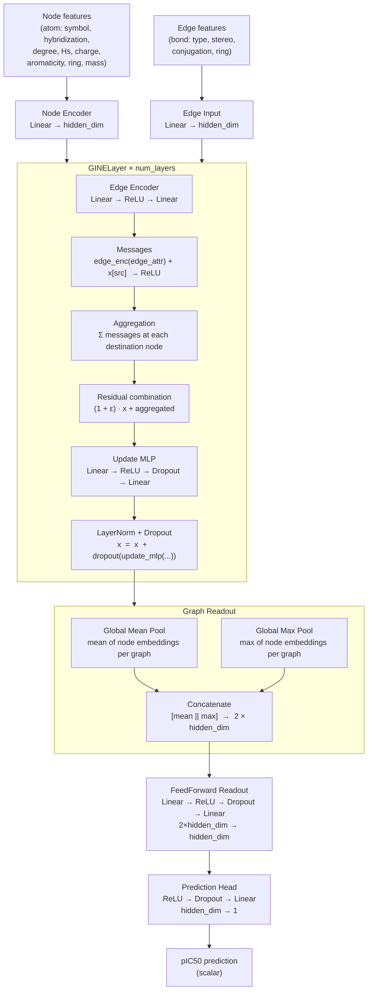

# GINE Regressor Architecture

## Component Summary

| Component | Structure | Purpose |
|---|---|---|
| Node Encoder | Linear | Projects raw atom features to hidden_dim |
| Edge Input | Linear | Projects raw bond features to hidden_dim |
| Edge Encoder (per layer) | Linear → ReLU → Linear | Transforms bond embeddings into message context |
| Update MLP (per layer) | Linear → ReLU → Dropout → Linear | Refines node embeddings after aggregation |
| GINELayer residual | (1 + ε) · x + aggregated | Learnable skip connection; ε is a per-layer parameter |
| Layer normalization | LayerNorm + Dropout | Stabilizes activations after each message-passing step |
| Global Mean Pool | Mean over nodes | Captures average molecular properties |
| Global Max Pool | Max over nodes | Captures the most prominent local features |
| FeedForward Readout | Linear → ReLU → Dropout → Linear | Compresses concatenated pooled representation |
| Prediction Head | ReLU → Dropout → Linear | Maps to a single scalar pIC50 value |
